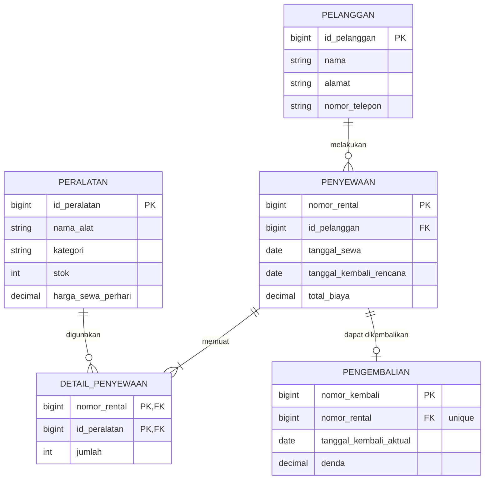

# Sistem Penyewaan Alat Camping

Sistem Penyewaan Alat Camping adalah aplikasi web manajemen penyewaan alat camping yang dibangun dengan **Laravel**, **Blade**, dan **Tailwind CSS**. Proyek ini difokuskan pada **perancangan database dan relasi antar tabel** menggunakan Eloquent ORM, mulai dari data pelanggan, peralatan, transaksi penyewaan, hingga pengembalian dan denda.

## Fitur

- Manajemen data pelanggan (nama, alamat, nomor telepon)
- Manajemen data peralatan camping beserta kategori, stok, dan harga sewa per hari
- Transaksi penyewaan dengan tanggal sewa dan tanggal kembali rencana
- Satu transaksi penyewaan dapat memuat banyak jenis peralatan beserta jumlahnya
- Perhitungan total biaya sewa berdasarkan lama sewa dan harga sewa per hari
- Pencatatan pengembalian alat dengan tanggal kembali aktual
- Perhitungan denda apabila pengembalian melebihi tanggal kembali rencana
- Pengurangan dan penambahan stok peralatan secara otomatis saat disewa dan dikembalikan

## Desain Database

Skema database dan seluruh relasinya didokumentasikan dengan diagram ERD berikut.


Versi Mermaid dari ERD yang sama:



### Struktur Tabel

| Tabel              | Primary Key                       | Foreign Key                      | Atribut Lain                                                      |
| ------------------ | --------------------------------- | -------------------------------- | ----------------------------------------------------------------- |
| `pelanggan`        | `id_pelanggan`                    | —                                | `nama`, `alamat`, `nomor_telepon`                                 |
| `penyewaan`        | `nomor_rental`                    | `id_pelanggan`                   | `tanggal_sewa`, `tanggal_kembali_rencana`, `total_biaya`          |
| `peralatan`        | `id_peralatan`                    | —                                | `nama_alat`, `kategori`, `stok`, `harga_sewa_perhari`             |
| `detail_penyewaan` | `nomor_rental` + `id_peralatan`   | `nomor_rental`, `id_peralatan`   | `jumlah`                                                          |
| `pengembalian`     | `nomor_kembali`                   | `nomor_rental`                   | `tanggal_kembali_aktual`, `denda`                                 |

### Relasi yang Tercakup

| Tipe                          | Contoh                                                                                                    |
| ----------------------------- | --------------------------------------------------------------------------------------------------------- |
| One-to-One (opsional, 1 ke 0..1) | `Penyewaan` ↔ `Pengembalian`                                                                           |
| One-to-Many                   | `Pelanggan` → `Penyewaan`, `Penyewaan` → `DetailPenyewaan`, `Peralatan` → `DetailPenyewaan`               |
| Many-to-Many with pivot data  | `Penyewaan` ↔ `Peralatan` melalui `detail_penyewaan` (`jumlah`)                                           |
| Has-Many-Through              | `Pelanggan` → `DetailPenyewaan` melalui `Penyewaan`                                                       |

### Aturan Bisnis

- Satu pelanggan dapat melakukan banyak penyewaan, tetapi setiap penyewaan hanya dimiliki satu pelanggan.
- Satu penyewaan dapat memuat banyak peralatan, dan satu peralatan dapat muncul di banyak penyewaan (relasi many-to-many melalui `detail_penyewaan`).
- Setiap penyewaan memiliki paling banyak satu data pengembalian (`0..1`); penyewaan tanpa pengembalian berarti alat belum dikembalikan.
- `jumlah` yang disewa tidak boleh melebihi `stok` peralatan yang tersedia.
- `total_biaya` = jumlah dari (`jumlah` × `harga_sewa_perhari` × lama sewa) untuk setiap peralatan dalam penyewaan.
- `denda` dikenakan jika `tanggal_kembali_aktual` lebih besar dari `tanggal_kembali_rencana`.

## Tech Stack

- PHP 8.3+ dan Laravel
- Blade templates
- Tailwind CSS (via Vite)
- MySQL atau SQLite

## Cara Menjalankan

```bash
# Clone repository
git clone https://github.com/maulidahasanah14/laravel5d
cd laravel5d

# Install dependensi
composer install
npm install

# Konfigurasi environment
cp .env.example .env
php artisan key:generate

# Buat skema database
php artisan migrate --seed

# Jalankan development server
npm run dev
php artisan serve
```

Kemudian buka <http://localhost:8000>.

## Struktur Proyek

```
app/Models/        Model Eloquent dan relasinya
database/
  migrations/      Definisi tabel
  factories/       Generator data dummy
  seeders/         Data awal peralatan dan contoh data
resources/views/   Template Blade
docs/
  database/        ERD dan dokumentasi relasi
```

## Roadmap

- [x] Perancangan dan dokumentasi database (ERD)
- [ ] Migration, model, factory, dan seeder
- [ ] CRUD pelanggan
- [ ] CRUD peralatan dan manajemen stok
- [ ] Transaksi penyewaan dan detail penyewaan
- [ ] Pengembalian dan perhitungan denda
- [ ] Laporan penyewaan

## Penulis

Maulida Hasanah — NPM <2410010242>

## Lisensi

Dirilis di bawah [MIT License](https://opensource.org/licenses/MIT).